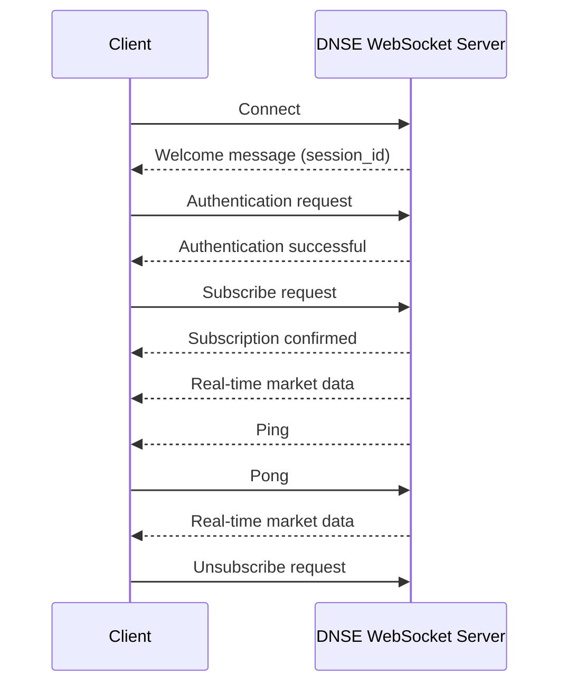

# DNSE WSS Protocol

Trang này mô tả chi tiết **WebSocket protocol** của DNSE để bạn tự implement client bằng bất kỳ ngôn ngữ nào.


---

## Tổng quan luồng kết nối



## Thông tin kết nối chung

- Base URL: `wss://ws-openapi.dnse.com.vn`
- Định dạng dữ liệu:
  - `msgpack`: Tốc độ xử lý nhanh, tiết kiệm băng thông
  - `json`: Phổ biến và dễ đọc trong quá trình phát triển
- Cơ chế kết nối:
  - Tất cả mã chứng khoán phải ở định dạng chữ in hoa. VD: ACB, HPG, 41I1G2000.
  - Một kết nối WebSocket có hiệu lực tối đa 8 giờ, WebSocket Server sẽ chủ động ngắt kết nối sau thời gian này.
  - Cơ chế để các clients duy trì kết nối ổn định tới WebSocket server DNSE:
    - WebSocket Server sẽ định kỳ gửi 1 PING message sau mỗi 3 phút.
    - Mỗi PING message được gửi từ WebSocket đều yêu cầu nhận PONG message phản hồi từ các client trong thời gian
      tối đa là 1 phút kể từ lúc Server gửi PING. Nếu quá thời hạn 1 phút này, Server sẽ chủ động ngắt kết nối với
      Client không đáp ứng.
    - Client được phép gửi PONG message ngay cả khi không nhận được PING từ Server, để chủ động duy trì kết nối.
      Cách này giúp client giữ kết nối trong các trường hợp PING message bị miss do network issue hoặc các gián đoạn
      tạm thời khác.

---

## Bước 1 — Kết nối

**Endpoint:**

```
wss://ws-openapi.dnse.com.vn/v1/stream?encoding={encoding}
```

| Query param | Giá trị | Mô tả |
|-------------|---------|-------|
| `encoding` | `json` hoặc `msgpack` | Định dạng toàn bộ message trong session. <br/>Khi dùng `msgpack`, server gửi **binary WebSocket frame**<br/>Khi dùng `json`, server gửi **text frame** UTF-8. | <br/>

Sau khi kết nối thành công, nhận **welcome message**:

```json lines
{
  "action": "welcome",
  "session_id": "conn_1782199800969809263",
  "timestamp": 1750000000,
  "message": "Please authenticate within 30 seconds"
}
```

`session_id` dùng để định danh kết nối, lưu lại để tiện debug/logging. Người dùng nhận được message này là tín hiệu sẵn sàng để thực hiện bước auth.

> **Lưu ý:** Client phải gửi auth message và auth thành công **trong vòng 30 giây** kể từ khi kết nối, nếu không server sẽ đóng kết nối (`{ "action": "error", "code": "AUTH_TIMEOUT" }`).

---

## Bước 2 — Xác thực (HMAC-SHA256)

Client phải gửi auth message. Server **không chấp nhận subscribe** trước khi auth thành công.

### Tạo chữ ký

```
message   = "{api_key}:{timestamp}:{nonce}"
signature = HMAC-SHA256(key=api_secret, msg=message).hexdigest()
```

| Trường | Kiểu | Mô tả |
|--------|------|-------|
| `api_key` | string | API Key của bạn |
| `timestamp` | integer | Unix timestamp tính bằng **giây** |
| `nonce` | string | Unix timestamp tính bằng **microseconds** — đảm bảo unique mỗi request |
| `api_secret` | string | Dùng làm HMAC key — **không** đưa vào message |

> **Ràng buộc quan trọng:**
> - `timestamp` phải nằm trong khoảng **±5 phút** so với giờ server, nếu không auth bị từ chối (`timestamp outside valid window`). Đảm bảo đồng hồ client được đồng bộ NTP.
> - `nonce` không được tái sử dụng trong vòng **10 phút** (server lưu để chống replay). Mỗi lần auth — kể cả khi reconnect — phải tạo `nonce` mới.

### Auth Request

```json lines
{
  "action": "auth",
  "api_key": "your_api_key",
  "signature": "a3f9c2d1e8b74...",
  "timestamp": 1750000000,
  "nonce": "1750000000123456"
}
```

### Auth Response

Thành công (ngoài `action` còn kèm một số trường thông tin, client có thể bỏ qua nếu không cần):

```json lines
{
  "action": "auth_success",
  "user_id": "your_api_key",
  "capabilities": { "batch_delivery": false },
  "rate_limit": { "messages_per_second": 100, "subscriptions_max": 100 }
}
```

Thất bại — server trả về control message `error` (không có action `auth_error`) rồi đóng kết nối:

```json lines
{ "action": "error", "code": "AUTH_FAILED", "message": "authentication failed: invalid signature" }
```

| `code` thường gặp | Nguyên nhân |
|---|---|
| `AUTH_FAILED` | Sai signature, sai api_key, nonce đã dùng, hoặc timestamp ngoài cửa sổ cho phép |
| `AUTH_TIMEOUT` | Không auth thành công trong 30 giây |
| `MAX_CONNECTIONS_EXCEEDED` | Vượt số kết nối tối đa cho phép của tier |

### Ví dụ signature (Python)

```python
import hmac, hashlib, time

api_key    = "your_api_key"
api_secret = "your_api_secret"

timestamp = int(time.time())                   # giây, integer
nonce     = str(int(time.time() * 1_000_000)) # microseconds, string
message   = f"{api_key}:{timestamp}:{nonce}"

signature = hmac.new(
    api_secret.encode("utf-8"),
    message.encode("utf-8"),
    hashlib.sha256
).hexdigest()
```

### Ví dụ tính signature (JavaScript)

```javascript
const crypto = require("crypto");

const apiKey    = "your_api_key";
const apiSecret = "your_api_secret";

const now       = Date.now();
const timestamp = Math.floor(now / 1000);              // giây, integer
const nonce     = String(now) + String(process.hrtime()[1]).slice(-3); // microseconds, string
const message   = `${apiKey}:${timestamp}:${nonce}`;

const signature = crypto
  .createHmac("sha256", apiSecret)
  .update(message)
  .digest("hex");
```

---

## Bước 3 — Subscribe stream

Sau khi auth thành công, gửi subscribe message để bắt đầu nhận dữ liệu.

### Request

```json lines
{
  "action": "subscribe",
  "channels": [
    {
      "name": "tick.G1.json",
      "symbols": ["ACB", "HPG"]
    }
  ]
}
```

| Trường | Mô tả |
|--------|-------|
| `action` | Luôn là `"subscribe"` |
| `channels[].name` | Tên channel — xem bảng bên dưới |
| `channels[].symbols` | Danh sách mã chứng khoán (chữ in hoa). Truyền `[]` cho các channel không filter theo mã |

**Channel theo từng loại dữ liệu:**

| Loại dữ liệu | Channel name | Ví dụ |
|---|---|---|
| Trade | `tick.{boardId}.{encoding}` | `tick.G1.msgpack` |
| Trade Extra | `tick_extra.{boardId}.{encoding}` | `tick_extra.G1.json` |
| Quotes | `top_price.{boardId}.{encoding}` | `top_price.G1.msgpack` |
| Expected Price | `expected_price.{boardId}.{encoding}` | `expected_price.G1.json` |
| Security Definition | `security_definition.{boardId}.{encoding}` | `security_definition.G1.json` |
| OHLC | `ohlc.{resolution}.{encoding}` | `ohlc.1.json` |
| OHLC Closed | `ohlc_closed.{resolution}.{encoding}` | `ohlc_closed.15.json` |
| Market Index | `market_index.{marketIndex}.{encoding}` | `market_index.VNINDEX.json` |
| Estimated Market Index | `estimated_market_index.{marketIndex}.{encoding}` | `estimated_market_index.VN30.json` |
| Foreign Investor | `foreign.{boardId}.{encoding}` | `foreign.G1.json` |
| Session | `session.{productGroupId}.{boardId}.{encoding}` | `session.STO.G1.json` |

Giá trị hợp lệ của `boardId`, `resolution`, `marketIndex` xem tại [Market Data Enums](./market-data-enums.md)

### Response

```json lines
{ "action": "subscribed" }
```

### Subscribe nhiều channel cùng lúc

```json lines
{
  "action": "subscribe",
  "channels": [
    { "name": "tick.G1.json",      "symbols": ["ACB", "HPG"] },
    { "name": "top_price.G1.json", "symbols": ["ACB"] }
  ]
}
```
---

## Bước 4 — Đọc dữ liệu inbound

Sau khi subscribe, client đọc message liên tục từ WebSocket. Có 2 loại message:

**Control messages** — message điều khiển vòng đời kết nối/subscription:

| `action` | Hướng | Mô tả |
|----------|-------|-------|
| `welcome` | Server → Client | Message đầu tiên sau khi kết nối (kèm `session_id`) |
| `auth_success` | Server → Client | Auth thành công |
| `subscribed` | Server → Client | Xác nhận subscribe thành công |
| `unsubscribed` | Server → Client | Xác nhận unsubscribe thành công |
| `ping` | Server → Client | Keepalive — phải phản hồi `pong` ngay |
| `pong` | Server → Client | Xác nhận ping từ client |
| `connection_expired` | Server → Client | Kết nối đạt giới hạn 8 giờ, server sắp đóng — client nên reconnect |
| `error` | Server → Client | Lỗi — xem trường `code` và `message` |

> Message lỗi có dạng `{ "action": "error", "code": "...", "message": "..." }` — dùng trường **`message`** (không phải `msg`).

**Data messages** — payload thị trường thực tế, nhận biết qua trường `"T"`.

> ⚠️ **Không** phân loại bằng "có trường `action` hay không". Phần lớn data message không có `action`, **nhưng một số loại (ví dụ `estimated_market_index`) lại có cả `action` lẫn `T`**. Cách an toàn là: chỉ coi là control message khi `action` thuộc tập các action điều khiển đã biết ở trên; còn lại (hoặc khi có trường `T`) là data message.

```python
CONTROL_ACTIONS = {
    "welcome", "auth_success", "subscribed", "unsubscribed",
    "ping", "pong", "connection_expired", "error",
}

action = data.get("action")
if action in CONTROL_ACTIONS:
    # xử lý control message
else:
    # data message — phân loại theo data["T"]
    msg_type = data.get("T")
```

Cấu trúc payload của từng loại xem tại [Market Data Channels](./market-data-channels.md), [Trading Data Channels](./trading-data-channels.md)

---

## Bước 5 — Unsubscribe

```json
{
  "action": "unsubscribe",
  "channels": [
    {
      "name": "tick.G1.json",
      "symbols": ["ACB"]
    }
  ]
}
```

---

## Bước 6 — Duy trì kết nối (PING/PONG)

Server và client dùng **application-level PING/PONG** (trường `action` trong JSON/msgpack), khác với WebSocket protocol-level ping/pong frame.

**Server gửi định kỳ** (kèm `timestamp` tính bằng milliseconds):

```json lines
{ "action": "ping", "timestamp": 1750000000123 }
```

Client phải phản hồi trong vòng **60 giây**, nếu không server sẽ đóng kết nối (close code `1008`):

```json lines
{ "action": "pong" }
```

> Để server đo được round-trip latency, client nên echo lại `timestamp` nhận được trong `pong`: `{ "action": "pong", "timestamp": 1750000000123 }`. Nếu bỏ trường này, keepalive vẫn hoạt động bình thường, chỉ là không có số liệu latency.

**Khuyến nghị:** Client nên chủ động gửi `ping` mỗi 25 giây để phòng trường hợp PING từ server bị miss do NAT timeout hoặc mobile network. Khi client gửi `ping`, server trả về `pong` (kèm `timestamp` tính bằng giây).

> Lưu ý: SDK Python mặc định gửi ping mỗi 25 giây (`heartbeat_interval=25.0`). Khi tự implement, hãy giữ interval tương đương.

<details>
  <summary>Ví dụ</summary>

- **Case 1: Good interaction**
  - T+0 min Server → PING
  - T+1 Client → PONG
  - T+3 min Server → PING
  - T+4 Client → PONG

  Client phản hồi PONG cho mỗi PING từ Server.

  ✅ Connection remains active

- **Case 2: Bad interaction**
  - T+0 min Server → PING
  - No PONG back from client
  - T+1 min Server disconnects

  Server đóng kết nối do không nhận được PONG trong khoảng thời gian kết nối định kỳ.

  ❌ Dead Connection

- **Case 3: Client-initiated keepalive**
  - Within every 3 minutes: Client → PONG

  Client có thể chủ động gửi PONG message để duy trì kết nối, đặc biệt trong các tình huống:
  - Một số thư viện WS thực hiện auto-handle ping/pong hoặc ẩn các ping frames đối với các app/clients
  - Mobile networks / NATs chủ động ngắt kết nối đối với các idle TCP connections
  - Miss PING frame từ server

  Do đó, việc cho phép clients định kỳ gửi PONG lên để Server xác nhận client vẫn đang hoạt động.

  ✅ Connection keep alive

</details>

---

## Reconnection

Khi kết nối bị ngắt, client cần thực hiện lại **toàn bộ luồng** từ đầu:

1. Kết nối lại → nhận welcome message mới (session_id mới)
2. Gửi lại auth message — **phải tạo `timestamp` và `nonce` mới**, không tái dùng giá trị cũ
3. Gửi lại tất cả subscribe message

**WebSocket close code:**

Các close code **server chủ động gửi**:

| Close code | Ý nghĩa | Nên reconnect? |
|------------|---------|----------------|
| 1000 | Normal closure (server đóng bình thường) | Có (trừ khi client chủ động đóng) |
| 1008 | Policy violation — heartbeat timeout (không pong), **hết 8 giờ** (kèm message `connection_expired`), hoặc admin ngắt | Có — đặc biệt với hết 8 giờ, server yêu cầu reconnect |
| 1013 | Try again later — client quá chậm, không kịp tiêu thụ message (write queue đầy) | Có, nhưng nên backoff lâu hơn và/hoặc giảm số channel |

Các close code **không do server gửi** mà sinh ra ở phía client/hạ tầng mạng — vẫn nên reconnect:

| Close code | Ý nghĩa |
|------------|---------|
| 1001 | Going away |
| 1006 | Abnormal closure (mất kết nối đột ngột, không có closing handshake) |
| 1011 / 1012 | Internal server error / restart (thường gặp khi qua proxy/gateway) |

> **Hết 8 giờ:** Trước khi đóng, server gửi `{ "action": "connection_expired", "code": "MAX_DURATION_EXCEEDED", "message": "Connection expired after 8 hours. Please reconnect." }` rồi đóng với code `1008`. Client **nên reconnect** ngay (đây là hành vi bình thường, không phải lỗi).

Nên dùng **exponential backoff** để tránh reconnect liên tục: `1s → 2s → 4s → 8s → ... → 60s (tối đa)`.

---

## Ví dụ hoàn chỉnh (Python)

```python
import asyncio, hmac, hashlib, time, json
import websockets

API_KEY    = "your_api_key"
API_SECRET = "your_api_secret"
URL        = "wss://ws-openapi.dnse.com.vn/v1/stream?encoding=json"

def make_auth_message():
    timestamp = int(time.time())
    nonce     = str(int(time.time() * 1_000_000))
    message   = f"{API_KEY}:{timestamp}:{nonce}"
    signature = hmac.new(
        API_SECRET.encode(), message.encode(), hashlib.sha256
    ).hexdigest()
    return {
        "action": "auth",
        "api_key": API_KEY,
        "signature": signature,
        "timestamp": timestamp,
        "nonce": nonce,
    }

async def send(ws, payload: dict):
    await ws.send(json.dumps(payload))

CONTROL_ACTIONS = {
    "welcome", "auth_success", "subscribed", "unsubscribed",
    "ping", "pong", "connection_expired", "error",
}

async def main():
    async with websockets.connect(URL) as ws:
        # 1. Welcome
        welcome = json.loads(await ws.recv())
        print("Session:", welcome.get("session_id"))

        # 2. Auth
        await send(ws, make_auth_message())
        auth_resp = json.loads(await ws.recv())
        assert auth_resp.get("action") == "auth_success", auth_resp

        # 3. Subscribe
        await send(ws, {
            "action": "subscribe",
            "channels": [
                {"name": "tick.G1.json", "symbols": ["ACB", "HPG"]}
            ]
        })

        # 4. Receive
        async for raw in ws:
            data = json.loads(raw)
            action = data.get("action")

            # Chỉ coi là control khi action thuộc tập đã biết.
            # (Một số data message như estimated_market_index cũng có "action".)
            if action in CONTROL_ACTIONS:
                if action == "ping":
                    # Echo lại timestamp để server đo được latency
                    await send(ws, {"action": "pong", "timestamp": data.get("timestamp")})
                elif action == "subscribed":
                    print("Subscribed OK")
                elif action == "connection_expired":
                    print("Server sắp đóng kết nối (8h) — cần reconnect")
                elif action == "error":
                    print("Error:", data.get("code"), data.get("message"))
            else:
                msg_type = data.get("T")
                print(f"[{msg_type}]", data.get("symbol"), data.get("matchPrice"))

asyncio.run(main())
```

## Tham khảo thêm

- Danh sách đầy đủ channel name và payload → [Market Data Channels](./market-data-channels.md), [Trading Data Channels](./trading-data-channels.md)
- SDK chính thức đã có sẵn (đã xử lý auth, reconnect, keepalive) → [DNSE sample SDKs](https://github.com/dnse-tech/openapi-sdk)