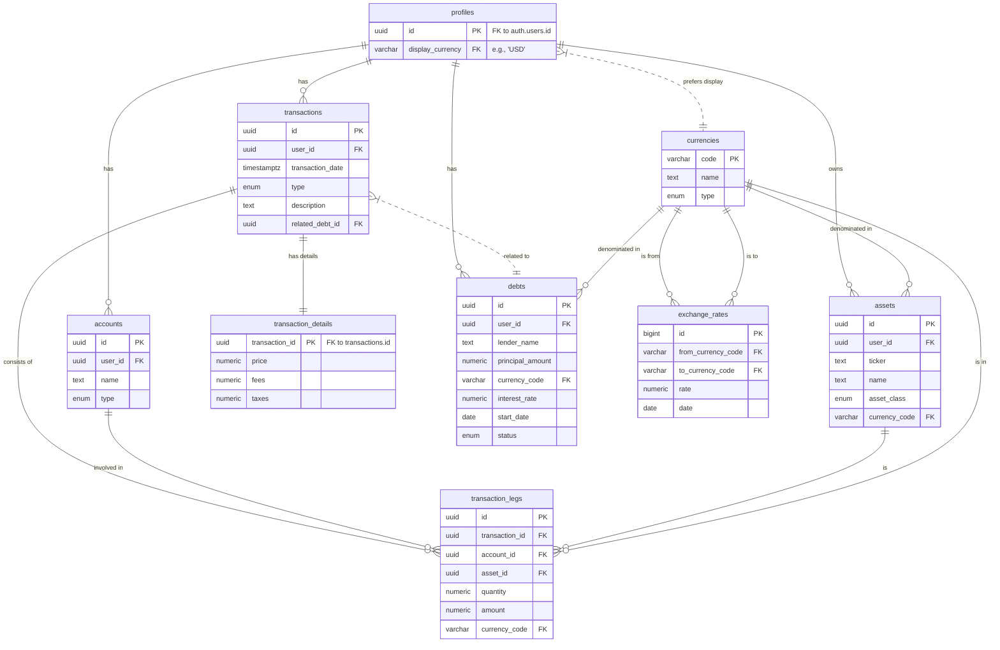

# Personal Investment Tracker - Database Schema

This document outlines the Supabase database schema for the personal investment tracking application.

### High-Level Design Philosophy

The design is based on a double-entry accounting principle. The core idea is to separate **Accounts** (where assets are held), **Assets** (what is owned), and **Transactions** (the events that change holdings). A dedicated `transaction_details` table stores specific data for buy/sell trades, such as price, fees, and taxes, keeping the core model clean and scalable.

### Mermaid ERD Diagram

### Table Definitions

---

#### 1. `profiles`
Stores user-specific application settings.

| Column | Type | Constraints | Description |
| :--- | :--- | :--- | :--- |
| `id` | `uuid` | **Primary Key**, Foreign Key to `auth.users.id` | The user's unique identifier. |
| `display_currency` | `varchar(10)` | Foreign Key to `currencies.code`, Not Null | The user's preferred currency for reporting. |

---

#### 2. `currencies`
A central table to define all supported currencies.

| Column | Type | Constraints | Description |
| :--- | :--- | :--- | :--- |
| `code` | `varchar(10)` | **Primary Key** | The currency ticker (e.g., 'VND', 'BTC'). |
| `name` | `text` | Not Null | The full name (e.g., 'Vietnamese Dong'). |
| `type` | `enum` | Not Null, ('fiat', 'crypto') | The type of currency. |

---

#### 3. `exchange_rates`
Stores historical exchange rates for currency conversion.

| Column | Type | Constraints | Description |
| :--- | :--- | :--- | :--- |
| `id` | `bigint` | **Primary Key** | Unique identifier for the rate entry. |
| `date` | `date` | Not Null | The date for which this rate is valid. |
| `from_currency_code` | `varchar(10)` | Foreign Key to `currencies.code`, Not Null | The base currency. |
| `to_currency_code` | `varchar(10)` | Foreign Key to `currencies.code`, Not Null | The target currency. |
| `rate` | `numeric` | Not Null | The conversion rate. |

---

#### 4. `accounts`
Represents the different places where you hold your assets.

| Column | Type | Constraints | Description |
| :--- | :--- | :--- | :--- |
| `id` | `uuid` | **Primary Key** | Unique identifier for the account. |
| `user_id` | `uuid` | Foreign Key to `profiles.id`, Not Null | The user who owns this account. |
| `name` | `text` | Not Null | A descriptive name (e.g., "VNDirect Brokerage"). |
| `type` | `enum` | Not Null, ('brokerage', 'crypto_exchange', 'epf', 'bank', 'wallet') | The type of account. |

---

#### 5. `assets`
A master list of all assets you can invest in.

| Column | Type | Constraints | Description |
| :--- | :--- | :--- | :--- |
| `id` | `uuid` | **Primary Key** | Unique identifier for the asset. |
| `user_id` | `uuid` | Foreign Key to `profiles.id`, Not Null | The user who owns this asset type. |
| `asset_class` | `enum` | Not Null, ('cash', 'stock', 'crypto', 'epf') | The high-level asset classification. |
| `ticker` | `text` | Not Null | The asset's ticker (e.g., 'HPG', 'VND_CASH'). |
| `name` | `text` | Not Null | The full name of the asset (e.g., "Hoa Phat Group"). |
| `currency_code` | `varchar(10)` | Foreign Key to `currencies.code`, Not Null | The currency the asset is valued in. |

---

#### 6. `debts`
Tracks money borrowed to invest.

| Column | Type | Constraints | Description |
| :--- | :--- | :--- | :--- |
| `id` | `uuid` | **Primary Key** | Unique identifier for the debt. |
| `user_id` | `uuid` | Foreign Key to `profiles.id`, Not Null | The user who has this debt. |
| `lender_name` | `text` | Not Null | Name of the person or institution you borrowed from. |
| `principal_amount`| `numeric` | Not Null | The initial amount borrowed. |
| `currency_code` | `varchar(10)` | Foreign Key to `currencies.code`, Not Null | The currency of the debt. |
| `interest_rate` | `numeric` | Not Null, Default: 0 | The annual interest rate. |
| `start_date` | `date` | Not Null | The date the debt was taken on. |
| `status` | `enum` | Not Null, ('active', 'paid_off') | The current status of the debt. |

---

#### 7. `transactions`, `transaction_details`, & `transaction_legs`
This three-table structure forms the core of the double-entry system.

**`transactions`**
Represents a single financial event (e.g., "Buy HPG Stock").

| Column | Type | Constraints | Description |
| :--- | :--- | :--- | :--- |
| `id` | `uuid` | **Primary Key** | Unique identifier for the transaction event. |
| `user_id` | `uuid` | Foreign Key to `profiles.id`, Not Null | The user who owns this transaction. |
| `transaction_date`| `timestamptz`| Not Null | The exact date and time of the transaction. |
| `type` | `enum` | Not Null, ('buy', 'sell', 'deposit', 'withdraw', 'expense', 'income', 'contribution', 'dividend', 'debt_payment', 'interest_payment') | The type of transaction. |
| `description` | `text` | Nullable | Optional user notes. |
| `related_debt_id` | `uuid` | Foreign Key to `debts.id`, Nullable | Links a transaction to a specific debt. |

**`transaction_details`**
Stores specific data for buy/sell trades.

| Column | Type | Constraints | Description |
| :--- | :--- | :--- | :--- |
| `transaction_id` | `uuid` | **Primary Key**, Foreign Key to `transactions.id` | Links these details to a specific transaction. |
| `price` | `numeric` | Not Null | The price per share/unit of the asset. |
| `fees` | `numeric` | Not Null, Default: 0 | Total fees for the trade. |
| `taxes` | `numeric` | Not Null, Default: 0 | Total taxes for the trade. |

**`transaction_legs`**
Represents the asset movements that make up a transaction.

| Column | Type | Constraints | Description |
| :--- | :--- | :--- | :--- |
| `id` | `uuid` | **Primary Key** | Unique identifier for the transaction leg. |
| `transaction_id`| `uuid` | Foreign Key to `transactions.id`, Not Null | Links this leg to a transaction event. |
| `account_id` | `uuid` | Foreign Key to `accounts.id`, Not Null | The account this leg affects. |
| `asset_id` | `uuid` | Foreign Key to `assets.id`, Not Null | The asset being moved. |
| `quantity` | `numeric` | Not Null | The change in the quantity of the asset. For cash, this is the amount. |
| `amount` | `numeric` | Not Null | The total value of this leg, including capitalized costs for trades. |
| `currency_code` | `varchar(10)` | Foreign Key to `currencies.code`, Not Null | The currency of the `amount`. |