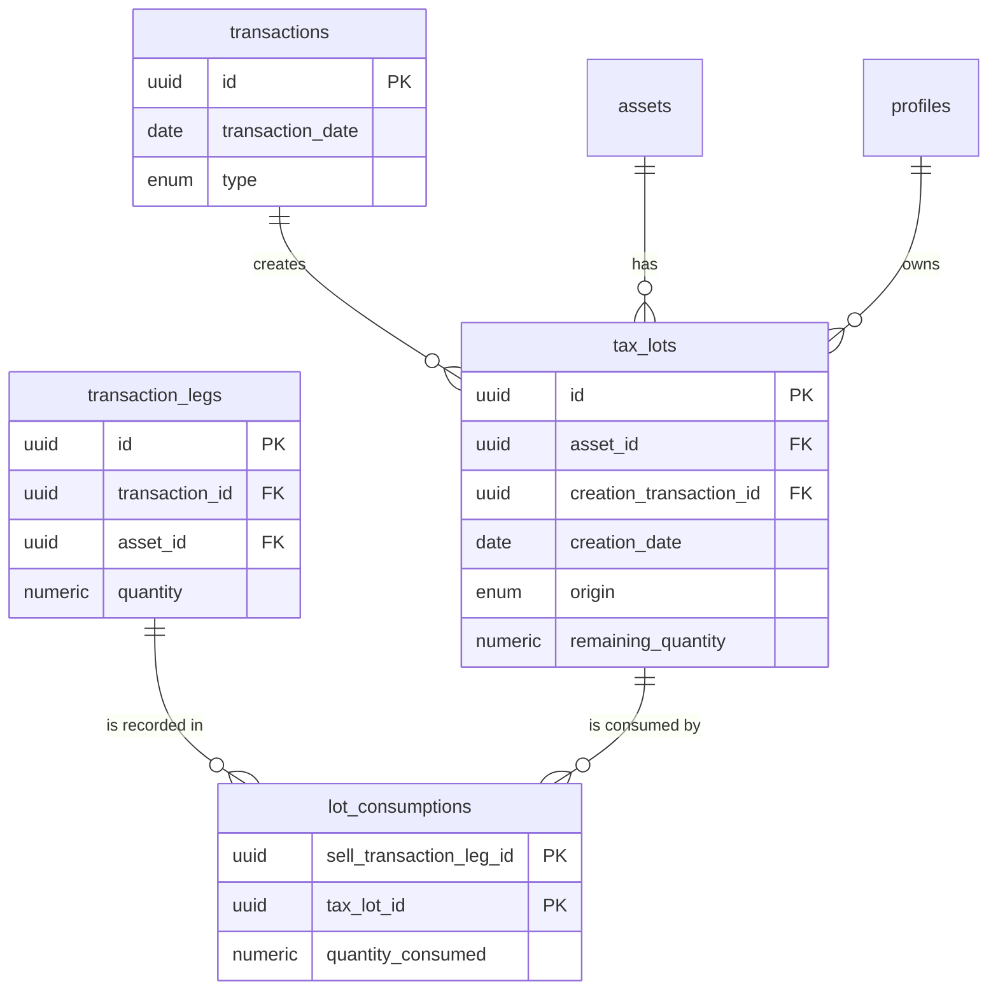

# Equity and Cost Basis Tracking Plan

This document outlines the architectural plan for accurately tracking equity components (Paid-in Capital, Retained Earnings) and implementing a robust FIFO (First-In, First-Out) cost basis tracking system for assets.

## 1. High-Level Strategy

The core of the strategy is to enhance the existing double-entry system to provide granular tracking of asset acquisitions and disposals. This is achieved by introducing two new tables to manage "tax lots" explicitly, rather than relying on virtual, on-the-fly calculations.

This approach provides:
-   **Accuracy**: Implements a true FIFO system.
-   **Performance**: Avoids complex and slow queries that recalculate history on every transaction.
-   **Auditability**: Creates an immutable record of how every sale is linked to its corresponding purchases.
-   **Flexibility**: Correctly handles complex corporate actions, such as the taxed stock splits common in Vietnam.

## 2. Foundational Equity Setup

### Conceptual Account
-   A single **`conceptual`** account will be created in the `accounts` table to hold all equity-related assets.
    -   **Name**: `Equity`
    -   **Type**: `conceptual`

### Equity Assets
-   Two assets will be created in the `assets` table with the `asset_class` of `'equity'`.
    -   **Paid-in Capital (`PIC`)**: Tracks all capital contributions (e.g., cash deposits).
    -   **Retained Earnings (`RE`)**: Tracks all profits from operations (dividends, interest) and realized gains from asset sales.

## 3. Schema Modifications

Two new tables will be added to the database.

### New Table: `tax_lots`
This table is the definitive record of every asset acquisition event.

| Column | Type | Constraints | Description |
| :--- | :--- | :--- | :--- |
| `id` | `uuid` | **Primary Key** | Unique identifier for the tax lot. |
| `user_id` | `uuid` | FK to `profiles.id`, Not Null | The user who owns this lot. |
| `asset_id` | `uuid` | FK to `assets.id`, Not Null | The asset this lot belongs to. |
| `creation_transaction_id` | `uuid` | FK to `transactions.id`, Not Null | The transaction that created this lot. |
| `origin` | `enum` | Not Null, `('purchase', 'split')` | How the lot was created. |
| `creation_date` | `date` | Not Null | The acquisition date, for FIFO ordering. |
| `original_quantity` | `numeric` | Not Null | The quantity of shares in this lot at creation. |
| `cost_basis` | `numeric` | Not Null | The total cost basis for this lot. |
| `remaining_quantity` | `numeric` | Not Null | Shares left in this lot. Updated on every sale. |

### New Table: `lot_consumptions`
This table creates an explicit, immutable link between a sale and the specific lots it drew from, providing a perfect audit trail.

| Column | Type | Constraints | Description |
| :--- | :--- | :--- | :--- |
| `sell_transaction_leg_id` | `uuid` | **PK**, FK to `transaction_legs.id` | The sale leg that consumed the shares. |
| `tax_lot_id` | `uuid` | **PK**, FK to `tax_lots.id` | The tax lot that was consumed. |
| `quantity_consumed` | `numeric` | Not Null | The number of shares consumed from this lot. |

### Updated ERD Diagram

## 4. Transaction Workflows

### `buy` Transaction
1.  Create the `buy` transaction and its legs as usual.
2.  Simultaneously, create a new record in the `tax_lots` table:
    -   `origin`: `'purchase'`
    -   `creation_date`: The `transaction_date`.
    -   `original_quantity` & `remaining_quantity`: The number of shares purchased.
    -   `cost_basis`: The `amount` from the corresponding transaction leg.

### `split` Transaction
This workflow correctly handles the Vietnamese tax on new shares from a split.
1.  Add `'split'` to the `transactions.type` enum.
2.  When a split occurs, create a `split` transaction.
3.  This transaction creates **one new lot** in `tax_lots`:
    -   `origin`: `'split'`
    -   `original_quantity` & `remaining_quantity`: The number of new shares received.
    -   `cost_basis`: The amount of tax paid to acquire the new shares.
4.  The cost basis and quantity of the original lots are **not** modified.

### `sell` Transaction (FIFO Logic)
1.  When selling `N` shares, query the `tax_lots` table for that asset where `remaining_quantity > 0`, ordered by `creation_date` ASC.
2.  In the application logic, iterate through the returned lots, consuming them one by one to fulfill the sale.
3.  For each lot consumed (fully or partially):
    -   Calculate the cost basis for the shares being sold from that specific lot.
    -   Create a record in `lot_consumptions` linking the sale leg to the tax lot.
    -   Atomically update the `remaining_quantity` on the `tax_lots` record.
4.  Sum the cost basis from all consumed lots. Use this total to create the 3-legged `sell` transaction:
    -   **Debit**: `Cash` (total proceeds from sale).
    -   **Credit**: `Stock Asset` (total calculated cost basis).
    -   **Credit**: `Retained Earnings` (the realized gain/loss).

### `withdraw` Transaction (Owner's Draw)
This workflow defines the ordering rule for distributions (e.g., taking cash out for personal use).

1.  **Prioritize Retained Earnings**: The withdrawal will first be drawn from the `Retained Earnings` asset.
2.  **Tap into Paid-in Capital**: If the withdrawal amount exceeds the available Retained Earnings, the remainder is drawn from the `Paid-in Capital` asset. This may result in a three-legged transaction.

**Example**: A user with $5,000 in Retained Earnings withdraws $8,000.
-   **Debit**: `Retained Earnings` is reduced by $5,000.
-   **Debit**: `Paid-in Capital` is reduced by $3,000.
-   **Credit**: `Cash` is reduced by $8,000.