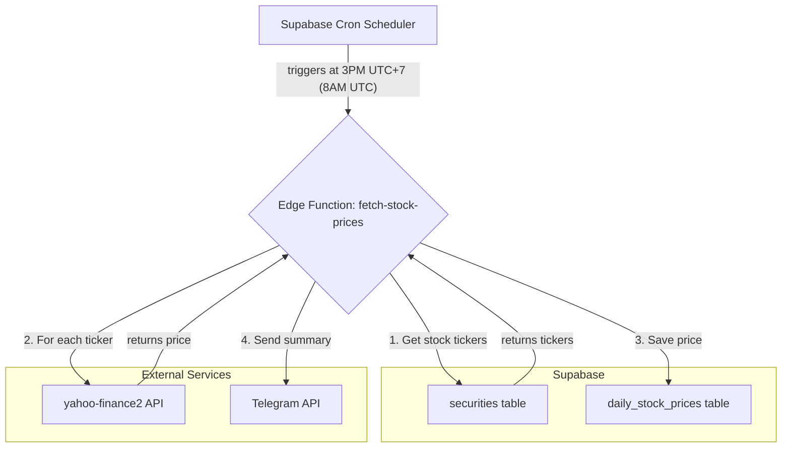

# Feature Plan: Automatic Daily Stock Price Fetching

This document outlines the plan to implement a feature that automatically fetches and stores daily stock prices for securities in the portfolio management application.

## 1. Overview

The goal is to create an automated daily process that retrieves the closing prices for all securities classified as "stock" and saves them to the `daily_stock_prices` table. The process will leverage the `yahoo-finance2` library for price data and will be implemented as a Supabase Edge Function, scheduled to run on a daily cron job.

Additionally, a notification system using Telegram will be integrated to provide a summary of the job's execution, including successes and failures.

## 2. System Architecture

The proposed architecture involves a Supabase Cron Scheduler, a Supabase Edge Function, and two external APIs (Yahoo Finance and Telegram).



## 3. Implementation Details

### Step 1: Prerequisites - Telegram Setup

Before implementation, you need to acquire credentials for the Telegram Bot API.

1.  **Create a Telegram Bot:**
    *   Talk to the `BotFather` on Telegram.
    *   Use the `/newbot` command and follow the instructions.
    *   BotFather will provide you with a **Bot Token**. Keep this safe.
2.  **Get your Chat ID:**
    *   Send a message to your newly created bot.
    *   Then, open your browser and go to the URL: `https://api.telegram.org/bot<YOUR_BOT_TOKEN>/getUpdates` (replace `<YOUR_BOT_TOKEN>` with your token).
    *   Look for the `result.message.chat.id` field in the JSON response. This is your **Chat ID**.

### Step 2: Securely Store Credentials in Supabase

The Telegram Bot Token and Chat ID must be stored as secrets in your Supabase project.

1.  Navigate to your Supabase project dashboard.
2.  Go to **Project Settings** > **Edge Functions**.
3.  Add two new secrets:
    *   `TELEGRAM_BOT_TOKEN`: Your bot token.
    *   `TELEGRAM_CHAT_ID`: Your chat ID.

### Step 3: Create the Supabase Edge Function

A new Edge Function will be created to handle the logic.

1.  **Create the function file:**
    *   Create a new directory: `supabase/functions/fetch-stock-prices`
    *   Inside this directory, create a file named `index.ts`.
2.  **Function Logic (`index.ts`):**
    *   **Import necessary libraries:** `supabase-js`, `yahoo-finance2`.
    *   **Initialize Supabase Client:** Create a Supabase client instance to interact with the database.
    *   **Retrieve Secrets:** Access the Telegram credentials using `Deno.env.get()`.
    *   **Fetch Securities:**
        *   Query the `securities` table.
        *   Select `id` and `ticker` for all rows where `asset_class` is `'stock'`.
    *   **Process Tickers:**
        *   Initialize two arrays: `successfulFetches` and `failedFetches`.
        *   Iterate through the list of securities.
        *   For each security, append `.VN` to the ticker to make it compatible with Yahoo Finance for Vietnamese stocks.
        *   Use a `try...catch` block to call `yahooFinance.quote(suffixedTicker)`.
        *   If successful, add an object `{ security_id, date, price }` to the `successfulFetches` array.
        *   If it fails, add the `ticker` to the `failedFetches` array and log the error.
    *   **Save Prices to Database:**
        *   If `successfulFetches` is not empty, use the Supabase client's `.from('daily_stock_prices').upsert()` method to insert or update the prices.
    *   **Send Telegram Notification:**
        *   Construct a summary message string. Example: `Daily Stock Price Update:\n- Success: ${successfulFetches.length}\n- Failed: ${failedFetches.length}\nFailed Tickers: ${failedFetches.join(', ')}`
        *   Use the `fetch` API to send a POST request to the Telegram Bot API endpoint: `https://api.telegram.org/bot<TOKEN>/sendMessage`.
        *   The request body should be a JSON object containing your `chat_id` and the `text` of the summary message.

### Step 4: Schedule the Edge Function

Configure a cron job in Supabase to run the function automatically.

1.  Create a new file: `supabase/schedules.sql` (or add to your existing cron job management).
2.  Add the following SQL to schedule the function:
    ```sql
    -- Schedule the fetch-stock-prices function to run at 8:00 AM UTC every weekday
    -- This corresponds to 3:00 PM in Vietnam (UTC+7)
    SELECT cron.schedule(
      'fetch-daily-stock-prices',
      '0 8 * * 1-5',
      $$
        SELECT net.http_post(
          url:='https://<YOUR_PROJECT_REF>.supabase.co/functions/v1/fetch-stock-prices',
          headers:='{"Authorization": "Bearer <YOUR_SERVICE_ROLE_KEY>"}'
        )
      $$
    );
    ```
    *   Replace `<YOUR_PROJECT_REF>` with your Supabase project reference ID.
    *   Replace `<YOUR_SERVICE_ROLE_KEY>` with your Supabase service role key (found in your project's API settings). **It is highly recommended to store this key as a secret.**

## 4. Next Steps

With this plan documented, the next step is to move to implementation. This involves writing the code for the Edge Function and setting up the necessary configurations in Supabase.