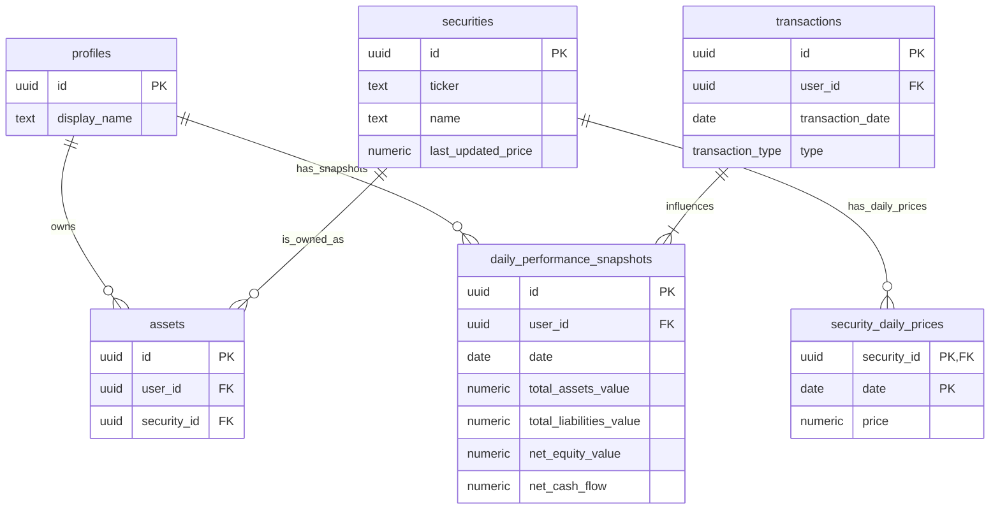

# Investment Performance Calculation Plan

This document outlines the plan to implement a robust and scalable investment performance calculation feature, starting with the Time-Weighted Rate of Return (TWR).

### **Overall Strategy**

The core of this plan is to **pre-calculate and store daily portfolio values and cash flows**. This avoids complex, slow calculations on-the-fly, ensuring the performance page loads quickly, even with years of transaction data. We will create a new table for this and a set of functions to populate and maintain it.

---

### **Phase 1: Database Schema Enhancements**

To calculate historical portfolio values, we first need historical prices for each asset. The current schema only stores the `last_updated_price`. We'll add a table for daily prices. Then, we'll add the main table for our daily snapshots.

#### **1. New Table: `security_daily_prices`**

This table will store the closing price for each security for each day. This is the foundational data needed for any historical valuation. With the new schema, prices are tied to the central `securities` table, not the user-specific `assets` table.

*   **Purpose:** To look up the market price of any security on any given day.
*   **SQL Definition:**
    ```sql
    CREATE TABLE "public"."security_daily_prices" (
        "security_id" "uuid" NOT NULL,
        "date" "date" NOT NULL,
        "price" numeric NOT NULL,
        CONSTRAINT "security_daily_prices_pkey" PRIMARY KEY ("security_id", "date"),
        CONSTRAINT "security_daily_prices_security_id_fkey" FOREIGN KEY ("security_id") REFERENCES "public"."securities"("id") ON DELETE CASCADE
    );

    ALTER TABLE "public"."security_daily_prices" ENABLE ROW LEVEL SECURITY;
    -- Prices are public for all authenticated users to read.
    -- Only service roles can write prices.
    CREATE POLICY "Authenticated users can read security prices" ON "public"."security_daily_prices"
        FOR SELECT USING (auth.role() = 'authenticated');
    CREATE POLICY "Service role can manage security prices" ON "public"."security_daily_prices"
        FOR ALL USING (auth.role() = 'service_role');
    ```

#### **2. New Table: `daily_performance_snapshots`**

This is the central table for our performance calculations. It will store the calculated values for each day.

*   **Purpose:** To provide a daily record of the user's portfolio value and cash flows, making TWR calculations fast and efficient.
*   **SQL Definition:**
    ```sql
    CREATE TABLE "public"."daily_performance_snapshots" (
        "id" "uuid" DEFAULT "gen_random_uuid"() NOT NULL,
        "user_id" "uuid" NOT NULL,
        "date" "date" NOT NULL,
        "total_assets_value" numeric NOT NULL,
        "total_liabilities_value" numeric NOT NULL,
        "net_equity_value" numeric NOT NULL,
        "net_cash_flow" numeric NOT NULL,
        CONSTRAINT "daily_performance_snapshots_pkey" PRIMARY KEY ("id"),
        CONSTRAINT "daily_performance_snapshots_user_id_fkey" FOREIGN KEY ("user_id") REFERENCES "public"."profiles"("id") ON DELETE CASCADE,
        CONSTRAINT "daily_performance_snapshots_user_id_date_key" UNIQUE ("user_id", "date")
    );

    ALTER TABLE "public"."daily_performance_snapshots" ENABLE ROW LEVEL SECURITY;
    CREATE POLICY "Users can manage their own performance snapshots" ON "public"."daily_performance_snapshots"
        USING ((( SELECT "auth"."uid"() AS "uid") = "user_id"))
        WITH CHECK ((( SELECT "auth"."uid"() AS "uid") = "user_id"));
    ```

#### **Database Diagram**



---

### **Phase 2: Data Population and Calculation Logic**

#### **1. Function: `generate_performance_snapshots(p_user_id, p_start_date, p_end_date)`**

This PostgreSQL function will backfill historical data by generating snapshots for a specific user and date range.

**Logic:**
1.  Loop through every day from `p_start_date` to `p_end_date`.
2.  For each day, calculate:
    *   **Total Assets Value:** Sum the market value of each security held by the user. The market value for one holding is `(quantity held at end of day) * (price from security_daily_prices)`. The quantity held is determined by summing the `quantity` field from the `transaction_legs` table for the user's specific asset up to that day.
    *   **Total Liabilities Value:** Calculate the outstanding balance of all debts, including accrued interest up to that day.
    *   **Net Cash Flow:** Sum amounts from `deposit` and `withdraw` transactions for that day.
3.  `INSERT` or `UPDATE` the row for that day in the `daily_performance_snapshots` table.

**Historical Data Requirement:** For this function to work, the `security_daily_prices` table must be populated with the historical daily prices for every security the user has ever owned.

#### **2. Function: `calculate_twr(p_user_id, p_start_date, p_end_date)`**

This function will read from the `daily_performance_snapshots` table to perform the final TWR calculation.

**Logic:**
1.  Fetch all snapshots for the user within the date range.
2.  Break the period into sub-periods based on cash flow dates.
3.  For each sub-period, calculate the Holding Period Return (HPR): `HPR = (EMV - BMV - CF) / BMV`
    *   `EMV` = Ending Market Value (`net_equity_value` at end of sub-period)
    *   `BMV` = Beginning Market Value (`net_equity_value` at start of sub-period)
    *   `CF` = Net Cash Flow (`net_cash_flow` during the sub-period)
4.  Geometrically link the HPRs to get the total TWR: `TWR = [(1 + HPR1) * (1 + HPR2) * ... * (1 + HPRn)] - 1`

---

### **Implementation Roadmap**

1.  **DB Migration:** Create a new migration file to add the `security_daily_prices` and `daily_performance_snapshots` tables.
2.  **Backend Logic:** Implement the `generate_performance_snapshots` and `calculate_twr` PostgreSQL functions.
3.  **Data Import:** Source historical daily prices and write a script to populate the `security_daily_prices` table.
4.  **Backfilling:** Run the `generate_performance_snapshots` function for all users to build the initial data.
5.  **API Endpoint:** Create a new API route (e.g., `/api/performance`) that calls the `calculate_twr` function.
6.  **Frontend Display:** In `src/app/performance/page.tsx`, fetch and display the TWR percentages.
7.  **(Future) Automation:** Add a database trigger to the `transactions` table to automatically re-calculate snapshots when past transactions are modified.