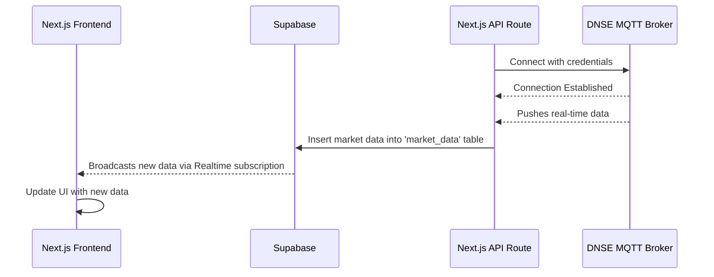

# Real-Time Market Data Integration Plan

This document outlines the steps to integrate a real-time market data feed from the DNSE MQTT broker into the existing Next.js application. The data will be pushed to a Supabase table, and the frontend will subscribe to updates using Supabase Realtime.

## 1. Architecture

The following diagram illustrates the data flow from the MQTT broker to the client application.



## 2. Backend Implementation

### Step 2.1: Supabase Setup

Create a table in your Supabase database to store the incoming market data. Go to the **SQL Editor** in your Supabase project and execute the following SQL script:

```sql
-- Create the table for market data
CREATE TABLE public.market_data (
    id BIGINT GENERATED BY DEFAULT AS IDENTITY PRIMARY KEY,
    created_at TIMESTAMPTZ DEFAULT NOW() NOT NULL,
    symbol TEXT NOT NULL,
    match_price REAL NOT NULL,
    match_quantity BIGINT NOT NULL,
    side TEXT,
    sending_time TIMESTAMPTZ
);

-- Enable Row-Level Security (RLS)
ALTER TABLE public.market_data ENABLE ROW LEVEL SECURITY;

-- Create a policy that allows public read access
CREATE POLICY "Allow public read access" ON public.market_data
    FOR SELECT
    USING (true);

-- Enable Realtime on the new table
ALTER PUBLICATION supabase_realtime ADD TABLE public.market_data;
```

### Step 2.2: Environment Variables

Create a `.env.local` file in the root of your project and add the following environment variables. These will be used to authenticate with the DNSE API and connect to the MQTT broker.

```env
# .env.local

# DNSE Credentials
DNSE_USERNAME="YOUR_DNSE_EMAIL_OR_PHONE"
DNSE_PASSWORD="YOUR_DNSE_PASSWORD"

# Supabase Credentials (already in your project)
NEXT_PUBLIC_SUPABASE_URL="YOUR_SUPABASE_URL"
NEXT_PUBLIC_SUPABASE_ANON_KEY="YOUR_SUPABASE_ANON_KEY"
SUPABASE_SERVICE_ROLE_KEY="YOUR_SUPABASE_SERVICE_ROLE_KEY"
```

### Step 2.3: MQTT Handler Logic

The core logic for connecting to the MQTT broker, handling messages, and saving data to Supabase will be encapsulated in a new file.

Create the file: `src/lib/mqtt-handler.ts`

```typescript
// src/lib/mqtt-handler.ts
import mqtt from 'mqtt';
import { createClient } from '@supabase/supabase-js';

// Initialize Supabase client
const supabase = createClient(
  process.env.NEXT_PUBLIC_SUPABASE_URL!,
  process.env.SUPABASE_SERVICE_ROLE_KEY!
);

let client: mqtt.MqttClient | null = null;

async function getDnseToken(username, password) {
  try {
    const response = await fetch("https://api.dnse.com.vn/user-service/api/auth", {
      method: 'POST',
      headers: { 'Content-Type': 'application/json' },
      body: JSON.stringify({ username, password }),
    });
    const data = await response.json();
    if (!response.ok) throw new Error(data.message || 'Authentication failed');
    console.log("Authentication successful!");
    return data.token;
  } catch (error) {
    console.error(`Authentication failed: ${error.message}`);
    return null;
  }
}

async function getInvestorId(token) {
    try {
        const response = await fetch("https://api.dnse.com.vn/user-service/api/me", {
            headers: { "authorization": `Bearer ${token}` },
        });
        const data = await response.json();
        if (!response.ok) throw new Error(data.message || 'Failed to get investor info');
        console.log("Get investor info successful!");
        return data.investorId;
    } catch (error) {
        console.error(`Failed to get investor info: ${error.message}`);
        return null;
    }
}


export async function connectMqtt() {
  if (client && client.connected) {
    console.log('MQTT client is already connected.');
    return;
  }

  const token = await getDnseToken(process.env.DNSE_USERNAME!, process.env.DNSE_PASSWORD!);
  if (!token) return;

  const investorId = await getInvestorId(token);
  if (!investorId) return;

  const BROKER_HOST = "datafeed-lts-krx.dnse.com.vn";
  const BROKER_PORT = 443;
  const clientId = `dnse-price-json-mqtt-ws-sub-${Math.floor(Math.random() * 1000)}`;

  client = mqtt.connect(`wss://${BROKER_HOST}:${BROKER_PORT}/wss`, {
    clientId,
    username: investorId.toString(),
    password: token,
    protocolVersion: 5,
    clean: true,
    connectTimeout: 4000,
    reconnectPeriod: 1000,
  });

  client.on('connect', () => {
    console.log('Connected to DNSE MQTT Broker!');
    // Subscribe to a topic, e.g., 'plaintext/quotes/krx/mdds/tick/v1/roundlot/symbol/VN30F1M'
    // The topic from the python script might be an example. You may need to find the correct one for your needs.
    client.subscribe('plaintext/quotes/krx/mdds/tick/v1/roundlot/symbol/41I1F7000', { qos: 1 }, (err) => {
        if(err) {
            console.error('Subscription error:', err);
        } else {
            console.log('Subscribed successfully!');
        }
    });
  });

  client.on('message', async (topic, message) => {
    try {
      const payload = JSON.parse(message.toString());
      console.log(`Received message from ${topic}:`, payload);

      const marketData = {
        symbol: payload.symbol,
        match_price: parseFloat(payload.matchPrice),
        match_quantity: parseInt(payload.matchQtty, 10),
        side: payload.side,
        sending_time: payload.sendingTime,
      };

      const { error } = await supabase.from('market_data').insert([marketData]);

      if (error) {
        console.error('Error inserting data to Supabase:', error);
      } else {
        console.log('Successfully inserted data to Supabase.');
      }
    } catch (e) {
      console.error('Error processing message:', e);
    }
  });

  client.on('error', (err) => {
    console.error('MQTT Client Error:', err);
    client.end();
  });

  client.on('close', () => {
    console.log('MQTT connection closed.');
  });
}
```

### Step 2.4: API Route to Trigger Connection

Modify the existing empty API route to trigger the MQTT connection. This endpoint will be called once to start the long-running MQTT client on the server.

Update the file: `src/app/api/auth/mqtt/route.ts`

```typescript
// src/app/api/auth/mqtt/route.ts
import { NextResponse } from 'next/server';
import { connectMqtt } from '@/lib/mqtt-handler';

export async function GET() {
  try {
    console.log("Attempting to connect to MQTT broker...");
    connectMqtt(); // This function now runs in the background
    return NextResponse.json({ message: 'MQTT connection process started.' });
  } catch (error) {
    console.error("Failed to start MQTT connection:", error);
    return NextResponse.json({ error: 'Failed to start MQTT connection' }, { status: 500 });
  }
}
```
**Note:** In a production environment, you would want a more robust way to manage this background process, but for development, calling this endpoint once will suffice to start the connection.

## 3. Frontend Implementation

### Step 3.1: Create a Component to Display Real-Time Data

Create a new client component that will subscribe to the `market_data` table in Supabase and display the updates in real-time.

Create the file: `src/components/market-data-feed.tsx`

```typescript
// src/components/market-data-feed.tsx
'use client';

import { useEffect, useState } from 'react';
import { createClient } from '@supabase/supabase-js';

// Define the type for our market data
type MarketData = {
  id: number;
  created_at: string;
  symbol: string;
  match_price: number;
  match_quantity: number;
  side: string;
  sending_time: string;
};

// Initialize the Supabase client (use public keys)
const supabase = createClient(
  process.env.NEXT_PUBLIC_SUPABASE_URL!,
  process.env.NEXT_PUBLIC_SUPABASE_ANON_KEY!
);

export default function MarketDataFeed() {
  const [data, setData] = useState<MarketData[]>([]);

  useEffect(() => {
    // Fetch initial data
    const fetchInitialData = async () => {
      const { data: initialData, error } = await supabase
        .from('market_data')
        .select('*')
        .order('created_at', { ascending: false })
        .limit(10);

      if (error) {
        console.error('Error fetching initial data:', error);
      } else if (initialData) {
        setData(initialData);
      }
    };

    fetchInitialData();

    // Set up the real-time subscription
    const channel = supabase
      .channel('market_data_changes')
      .on(
        'postgres_changes',
        { event: 'INSERT', schema: 'public', table: 'market_data' },
        (payload) => {
          console.log('New data received!', payload);
          setData((currentData) => [payload.new as MarketData, ...currentData]);
        }
      )
      .subscribe();

    // Cleanup subscription on component unmount
    return () => {
      supabase.removeChannel(channel);
    };
  }, []);

  return (
    <div className="p-4 border rounded-lg">
      <h2 className="text-xl font-bold mb-4">Real-Time Market Feed</h2>
      <div className="overflow-x-auto">
        <table className="min-w-full divide-y divide-gray-200">
          <thead className="bg-gray-50">
            <tr>
              <th className="px-6 py-3 text-left text-xs font-medium text-gray-500 uppercase tracking-wider">Symbol</th>
              <th className="px-6 py-3 text-left text-xs font-medium text-gray-500 uppercase tracking-wider">Price</th>
              <th className="px-6 py-3 text-left text-xs font-medium text-gray-500 uppercase tracking-wider">Quantity</th>
              <th className="px-6 py-3 text-left text-xs font-medium text-gray-500 uppercase tracking-wider">Side</th>
              <th className="px-6 py-3 text-left text-xs font-medium text-gray-500 uppercase tracking-wider">Time</th>
            </tr>
          </thead>
          <tbody className="bg-white divide-y divide-gray-200">
            {data.map((item) => (
              <tr key={item.id}>
                <td className="px-6 py-4 whitespace-nowrap">{item.symbol}</td>
                <td className="px-6 py-4 whitespace-nowrap">{item.match_price}</td>
                <td className="px-6 py-4 whitespace-nowrap">{item.match_quantity}</td>
                <td className="px-6 py-4 whitespace-nowrap">{item.side}</td>
                <td className="px-6 py-4 whitespace-nowrap">{new Date(item.sending_time).toLocaleTimeString()}</td>
              </tr>
            ))}
          </tbody>
        </table>
      </div>
    </div>
  );
}
```

### Step 3.2: Add the Component to a Page

Finally, add the `MarketDataFeed` component to any page where you want to display the data. For example, you can add it to your main page.

Update the file: `src/app/page.tsx`

```typescript
// src/app/page.tsx
import MarketDataFeed from '@/components/market-data-feed';

export default function HomePage() {
  return (
    <main className="container mx-auto p-4">
      <h1 className="text-2xl font-bold mb-4">Dashboard</h1>
      {/* Other components can go here */}
      <MarketDataFeed />
    </main>
  );
}
```

## 4. Running the Implementation

1.  **Install Dependencies**: Ensure you have the necessary packages.
    ```bash
    npm install mqtt
    ```
2.  **Start the development server**:
    ```bash
    npm run dev
    ```
3.  **Start the MQTT client**: In your browser, navigate to `http://localhost:3000/api/auth/mqtt`. You should see a JSON response `{"message":"MQTT connection process started."}`. Check your terminal where `npm run dev` is running to see the connection logs from `mqtt-handler.ts`.
4.  **View the Real-Time Feed**: Open your application's home page (`http://localhost:3000`) to see the `MarketDataFeed` component, which will update in real-time as new data arrives from the broker.

This plan provides a complete guide for implementing the feature.